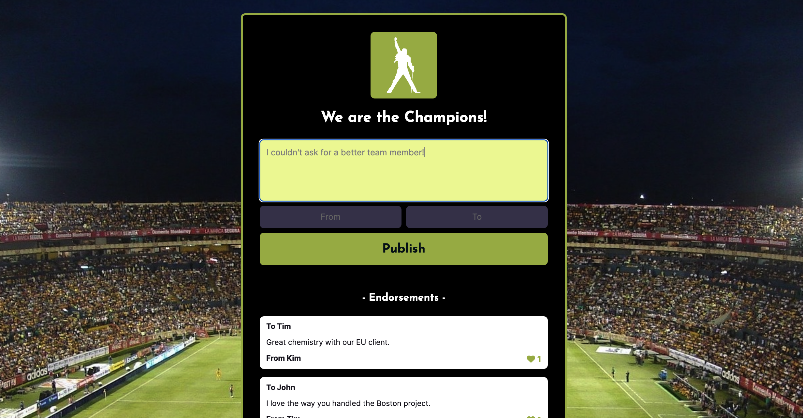
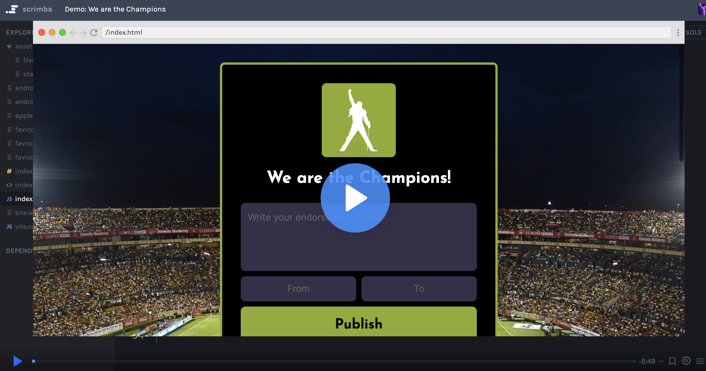

# We Are The Champions!
An endorsements app that helps the Acme sales team members endorse each other on project successes. The app is built with HTML, CSS, and vanilla JavaScript. It stores data in a Firebase Realtime Database as well as the browser `localStorage`. 




## In This Document:
1. [Live Application URL](#live-application-url)
2. [Demo and Code Walkthrough](#demo-and-code-walkthrough)
3. [How to Use the Application](#how-to-use-the-application)
4. [Technologies Used](#technologies-used)
5. [Future Features](#future-features)
6. [Challenges and Learning Points](#challenges-and-learning-points)

## Live Application URL
https://we-are-the-champions-shant.netlify.app/

## Demo and Code Walkthrough
[](https://scrimba.com/scrim/cy4aWBUe)

## How to Use the Application
1. Sales team member browses to the app's welcome page.
2. Sales team member writes an endorsement, with their name and the name of the endorsee.
3. Sales team member clicks on Publish to have the endorsement published and placed at the top of endorsements.
4. Sales team member can like any endorsement by clicking the heart icon on an endorsement.

## Technologies Used
1. HTML, CSS, and JavaScript.
2. [Firebase Realtime Database](https://console.firebase.google.com/) 

## Future Features:
1. Sales team member can create an account to personalize their experience and have their likes and endorsements saved.

## Challenges and Learning Points:
1. Figuring out how to store the endorsements map in `localStorage`. It turns out, it needed to be converted to an array first. The same is true to get it back. The array stored is converted back to a JavaScript `Map`.
```
localStorage.setItem('endorsements', JSON.stringify(Array.from(endorsements)))

new Map(JSON.parse(localStorage.getItem('endorsements')))
```
2. Updating an endorsement in the database required a reference to the specific location and using the `update` function.
```
const endorsementLikesRef = ref(database,`endorsements/${key}`)
update(endorsementLikesRef, {likes: endorsement.likes})
```
<hr>

[Up](README.md)
